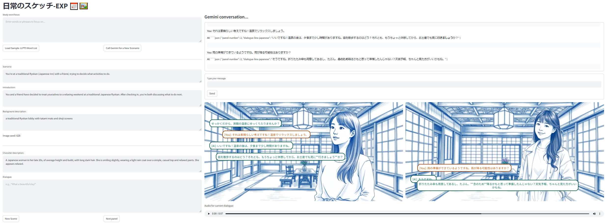

# :cherry_blossom: free-genai-bootcamp-2025 :cherry_blossom:

:white_flower: https://genai.cloudprojectbootcamp.com/ :white_flower:

日常のスケッチ-EXP (Sketches of Everyday Life-EXP) is an experiment into a immersive Japanese language learning activity that creates an interactive visual conversation to help users practice Japanese in context. The application generates everyday 'vignettes' using manga-style panels with dialogue bubbles, allowing users to engage in natural Japanese conversations while practicing a user supplied vocabulary.

# This is a personal experiment as part of Bootcamp activity (see above) - for more details see
- IMMERSIVE_SPEC.MD
- INSTALL.MD

It is *deinitely not* fully functional as the control flow from LLM is not working at all reliably... but I have learned from the experience!

